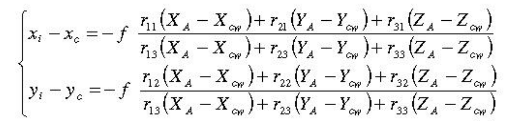
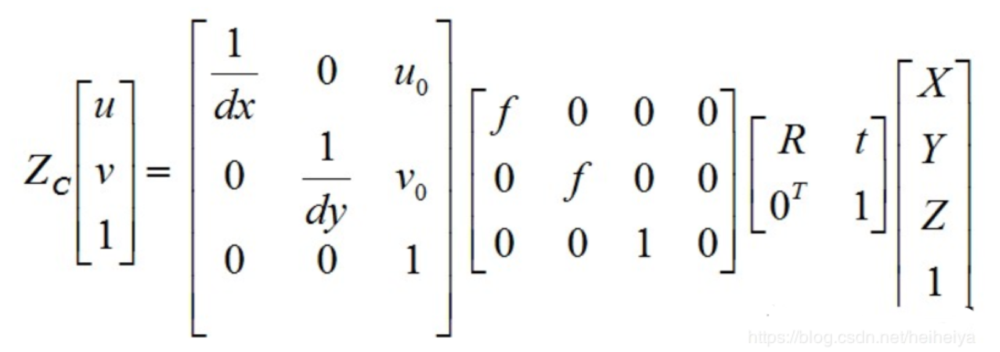

# LiDAR-Camera-calibration
#### Introduction
This provides code for Lidar-camera calibration using Gauss-Newton descending method

#### Hardware
1. Livox Mid-40 LiDAR
2. HIKVISION Camera
#### Software
1. MATLAB 2014+
2. LivoxViewer
3. Polyworks 2018+
4. Photoshop CS6+

#### Install

1. Livox Mid-40 LiDAR
www.livoxtech.com
2. Other softwares are avaliable online.

#### Instructions

1. Use Livoxviewer for raw point clouds, polyworks for processing them, photoshop for finding points.
2. Use MATLAB toolbox for camera intristic parameters.
3. The algorithm is based on two sets of formulas：

Rotation matrix is orthogonal

4. The transformation matrix for camera and LiDAR：

Results：
Camera image：

Camera with points：

Reference：

T. Marita, F. Oniga, S. Nedevschi, T. Graf, and R. Schmidt, "Camera calibration 
method for far range stereovision sensors used in vehicles," in IEEE Intelligent 
Vehicles Sysposium, 6 2007, pp. 356-363. 

Bódis-Szomorú A, Dabóczi T, Fazekas Z. A far-range off-line camera calibration 
method for stereo lane detection systems[C]//Instrumentation and Measurement 
Technology Conference Proceedings, 2007. IMTC 2007. IEEE. IEEE, 2007: 1-6. 

Fusiello A, Irsara L. Quasi-euclidean uncalibrated epipolar 

Contribution:
Dongming Chang
